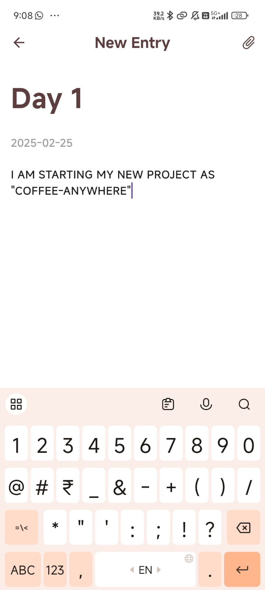

# Smart Journal - Personal Diary App

## Introduction
Smart Journal is a feature-rich Flutter application that serves as your personal digital diary. It provides a secure and intuitive platform for users to document their thoughts, memories, and experiences while leveraging modern AI capabilities for enhanced interaction with past entries.

## Features

### Core Features
- 🖊️ Create and edit journal entries with titles and timestamps
- 🎨 Automatic color themes for entries
- 📱 Clean and intuitive user interface
- 💾 Local storage using Hive database
- 🔍 Search through past entries

### Smart Features
- 🤖 AI-powered memory search and interaction
- 💭 Natural conversation with your past entries
- 🔄 Context-aware follow-up responses
- 📊 Semantic understanding of journal content

### UI/UX Features
- ✨ Smooth animations and transitions
- 🌗 Custom toast notifications
- 📱 Responsive design
- 🎯 Material Design principles

## Screenshots

<div style="display: flex; flex-direction: row; gap: 10px; justify-content: space-between;">
    
    
    
    
</div>


## Technical Implementation

### Built With
- Flutter SDK
- Dart
- Hive Local Database
- Google Gemini API
- AI Embedding
- Pinecone Vector Database

### Key Dependencies
```yaml
dependencies:
  google_fonts: ^6.2.1
  hive: ^2.2.3
  hive_flutter: ^1.1.0
  flutter_dotenv: ^5.2.1
  lottie: ^3.2.0
  animated_text_kit: ^4.2.3
  ```

  ### Future Aspects
1. Enhanced Security

    - End-to-end encryption
    - Biometric authentication
2. Rich Media Support
    - Image attachments
    - Voice notes
    - Location tagging
3. Advanced AI Features

    - Mood analysis
    - Writing suggestions
    - Pattern recognition
4. Cloud Integration

    - Cross-device synchronization
    - Backup and restore
    - Sharing capabilities


### Contributing
We welcome contributions to Smart Journal! Here's how you can help:

1. Fork the repository

2. Create a feature branch

```
git checkout -b feature/AmazingFeature
```
3. Commit your changes 

```
git commit -m 'Add some AmazingFeature'
```

4. Push to the branch 

```
git push origin feature/AmazingFeature
```
5. Open a Pull Request


### Setup Instructions
1. Clone the repository
2. Install dependencies: 
```
flutter pub get
```

3. Create `.env` file with required API keys:

```
GEMINI_API_KEY=your_key_here
PINECONE_API_KEY=your_key_here
PINECONE_ENDPOINT=your_endpoint_here
```
4. Run the app:
 
 ```
 flutter run
 ```


### License
> Distributed under the MIT License. See LICENSE for more information.


